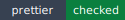
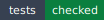

<!-- markdownlint-disable MD013 MD033 -->
<!-- This file is generated by Paradox. Do not edit manually. -->

# @ankhorage/runtime

        

Platform-neutral runtime contracts and helpers for Ankhorage generated apps.

## Usage

### Generic runtime boundary

`@ankhorage/runtime` owns platform-neutral runtime contracts for generated apps.

This first package slice is intentionally metadata-only plus public contracts so
`ankhorage4#430` can move real runtime implementation into a stable target.

Source: `src/readme-usage.ts`

```ts
import { createRuntimeManifest } from './index.js';

createRuntimeManifest({
  config: {
    appId: 'demo',
  },
});
```

## Generated documentation

- [Interactive documentation app](./paradox/index.html)
- [Public API reference](./paradox/exports.md)
- [Component registry](./paradox/components.md)
- [Architecture overview](./paradox/diagrams/architecture-overview.mmd)
- [Module relationships](./paradox/diagrams/module-relationships.mmd)
- [Export graph](./paradox/diagrams/export-graph.mmd)
